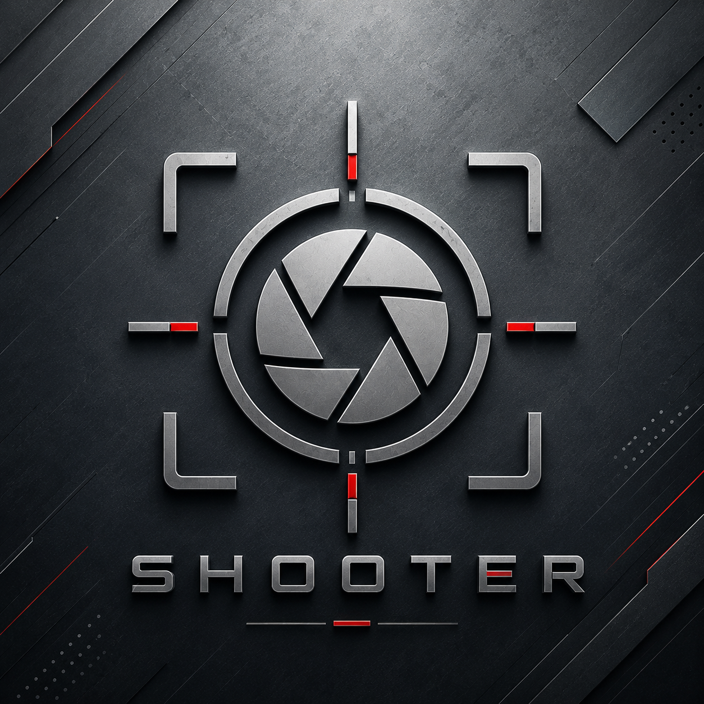

# Shooter

<p align="center">
  
</p>

**Shooter** is a Linux command-line tool for controlling a **FLIR Boson thermal camera** using the Boson SDK.

It provides simple commands for AGC, FFC, image correction, palettes, camera status, diagnostics, and configuration.

## Installation

Clone the repository with the Boson SDK submodule:

```bash
git clone --recurse-submodules <repository-url>
cd shooter
```

If the repository was already cloned:

```bash
git submodule update --init --recursive
```

Install:

```bash
pip install -e .
```

## Usage

```bash
shooter [--port PORT] <command> [options]
```

Default serial port:

```text
/dev/ttyACM0
```

Use another port:

```bash
shooter --port /dev/ttyUSB0 get-tfpa
```

Show all commands:

```bash
shooter --help
```

Show help for one command:

```bash
shooter set-color --help
```

## Examples

Get camera temperature:

```bash
shooter get-tfpa
```

Change color palette:

```bash
shooter set-color --color ironbow
```

Set AGC mode:

```bash
shooter set-agc-mode --mode normal
```

Run FFC:

```bash
shooter do-ffc
```

Freeze video:

```bash
shooter video-freeze --mode on
```

Generate a camera configuration report:

```bash
shooter configuration-report
```

---

## Commands

| Command | Description | Parameters |
|---|---|---|
| `averager-mode` | Enable or disable frame averaging | `--mode {on,off}` |
| `get-frame-rate` | Get video output frame rate | — |
| `set-frame-rate` | Set video output frame rate | `--framerate {30,60}` |
| `get-color` | Get current color palette | — |
| `set-color` | Set color palette | `--color` |
| `set-image-orientation` | Set image orientation | `--mode {normal,horizontal,vertical,both}` |
| `video-freeze` | Freeze or resume video | `--mode {on,off}` |
| `ramp-enabled` | Enable or disable diagnostic test ramp | `--mode {on,off}` |
| `get-agc-mode` | Get AGC mode | — |
| `set-agc-mode` | Set AGC mode | `--mode` |
| `get-agc-tail-rejection` | Get AGC histogram tail rejection | — |
| `set-agc-tail-rejection` | Set AGC histogram tail rejection | `--data` |
| `get-agc-max-gain` | Get maximum AGC gain | — |
| `set-agc-max-gain` | Set maximum AGC gain | `--data` |
| `get-agc-damping-factor` | Get AGC damping factor | — |
| `set-agc-damping-factor` | Set AGC damping factor | `--data` |
| `get-agc-adaptive-contrast-enhancement` | Get adaptive contrast enhancement | — |
| `set-agc-adaptive-contrast-enhancement` | Set adaptive contrast enhancement | `--data` |
| `get-agc-plateau-value` | Get AGC plateau value | — |
| `set-agc-plateau-value` | Set AGC plateau value | `--data` |
| `get-agc-linear-percent` | Get AGC linear percentage | — |
| `set-agc-linear-percent` | Set AGC linear percentage | `--data` |
| `get-agc-detail-headroom` | Get AGC detail headroom | — |
| `set-agc-detail-headroom` | Set AGC detail headroom | `--data` |
| `get-agc-digital-detail-enhancement` | Get digital detail enhancement | — |
| `set-agc-digital-detail-enhancement` | Set digital detail enhancement | `--data` |
| `get-agc-smoothing-factor` | Get AGC smoothing factor | — |
| `set-agc-smoothing-factor` | Set AGC smoothing factor | `--data` |
| `get-agc-information-based-mode` | Get information-based AGC state | — |
| `set-agc-information-based-mode` | Enable or disable information-based AGC | `--mode {on,off}` |
| `flat-field-correction` | Enable or disable flat-field correction | `--mode {on,off}` |
| `gain-correction` | Enable or disable gain correction | `--mode {on,off}` |
| `defect-replacement` | Enable or disable bad-pixel replacement | `--mode {on,off}` |
| `column-filter` | Enable or disable column filtering | `--mode {on,off}` |
| `temporal-filter` | Enable or disable temporal filtering | `--mode {on,off}` |
| `silent-shutterless-nuc` | Enable or disable Silent Shutterless NUC | `--mode {on,off}` |
| `supplemental-ffc` | Enable or disable supplemental FFC | `--mode {on,off}` |
| `do-ffc` | Run FFC immediately | — |
| `get-ffc-mode` | Get FFC mode | — |
| `set-ffc-mode` | Set FFC mode | `--mode` |
| `get-ffc-period` | Get automatic FFC period | — |
| `set-ffc-period` | Set automatic FFC period | `--data` |
| `get-ffc-temp-delta` | Get FFC temperature delta | — |
| `set-ffc-temp-delta` | Set FFC temperature delta | `--value` |
| `get-ffc-integration-period` | Get FFC integration frame count | — |
| `set-ffc-integration-period` | Set FFC integration frame count | `--data {2,4,8,16}` |
| `get-ffc-warning-time` | Get FFC warning time | — |
| `set-ffc-warning-time` | Set FFC warning time | `--ffcWarnTime` |
| `get-nuc-table` | Get active NUC table | — |
| `set-nuc-table` | Set desired NUC table | `--tableNumber` |
| `get-image-mean-intensity` | Get mean image pixel intensity | — |
| `get-roi-min` | Get minimum ROI pixel intensity | — |
| `get-roi-max` | Get maximum ROI pixel intensity | — |
| `get-roi-mean` | Get mean ROI pixel intensity | — |
| `get-defect-stats` | Get bad-pixel replacement statistics | — |
| `get-tfpa` | Get FPA temperature | — |
| `get-imaging-status` | Get image-valid status | — |
| `get-camera-software-version` | Get camera software version | — |
| `get-camera-firmware-version` | Get camera firmware version | — |
| `get-camera-product-number` | Get camera product number | — |
| `get-camera-serial-number` | Get camera serial number | — |
| `get-overtemp-threshold` | Get overtemperature threshold | — |
| `get-core-temp` | Get camera core temperature | — |
| `get-low-power-state` | Get low-power state | — |
| `get-overtemp-status` | Get overtemperature event status | — |
| `get-overtemp-counter` | Get overtemperature event counter | — |
| `save-power-on-defaults` | Save current settings as power-on defaults | — |
| `restore-factory-defaults` | Restore factory settings | `--confirm true` |
| `configuration-report` | Print camera configuration as JSON | — |
| `reboot-camera` | Reboot the camera | `--confirm true` |

For exact options, ranges, and accepted values:

```bash
shooter <command> --help
```

For example:

```bash
shooter set-agc-mode --help
```

## Shell Auto-completion

Shooter uses `argcomplete` for optional command-line completion.

After installing the package, global argcomplete activation can usually be enabled with:

```bash
activate-global-python-argcomplete --user
```

Restart the shell afterward.

You can then use Tab completion for Shooter commands and argument choices.
